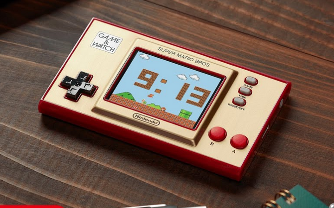

# Game & Watch Super Mario Bros 35th anniversary

***[Working on it]***

Guia para modificar el FW original y poder obtener:

- Emulador RetroGo:
  - NES
  - GameBoy
  - Game Gear
  - Master System
  - PC Engine (parcial)

- Emulador LCD:
  - G&W Nintendo
  - Konami, Tiger, etc.

- Launcher para ejecutables de terceros (ELF) o desarrollos propios.

- Posibilidad de mantener el FW original
  - Pulsando *derecha + GAME + A* se accede al Launcher.

---

## 1. Preparación

### 1.1 Material necesario

 

[TBD]

***

## Contacto

Grupo [Discord](https://discord.gg/xhUmXe8G) en español
Grupo [Discord](https://discord.gg/vVcwrrHTNJ) en ingles, más contenido.
Hilo [EOL](https://www.elotrolado.net/hilo_game-watch-super-mario_2391666_s1150).
[Launcher, emulador G&W, utlidades y otros binarios](https://www.schuerewegen.tk/gnw/)

## Licencia

Los proyectos aquí mencionados están licenciados bajo la GPLv2 / MIT license.
Y según las licencias mecionadas en [www.schuerewegen.tk](https://www.schuerewegen.tk/gnw/) para otras utilidades y binarios de este manual.
